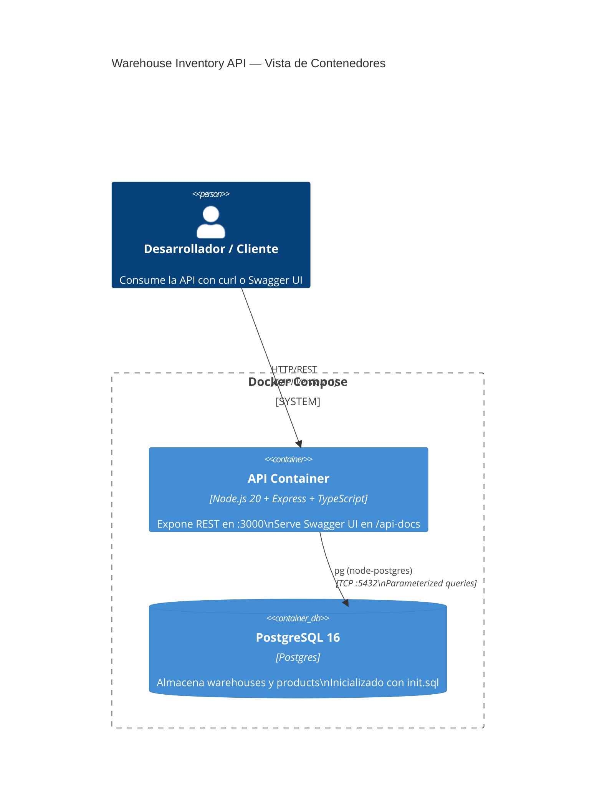
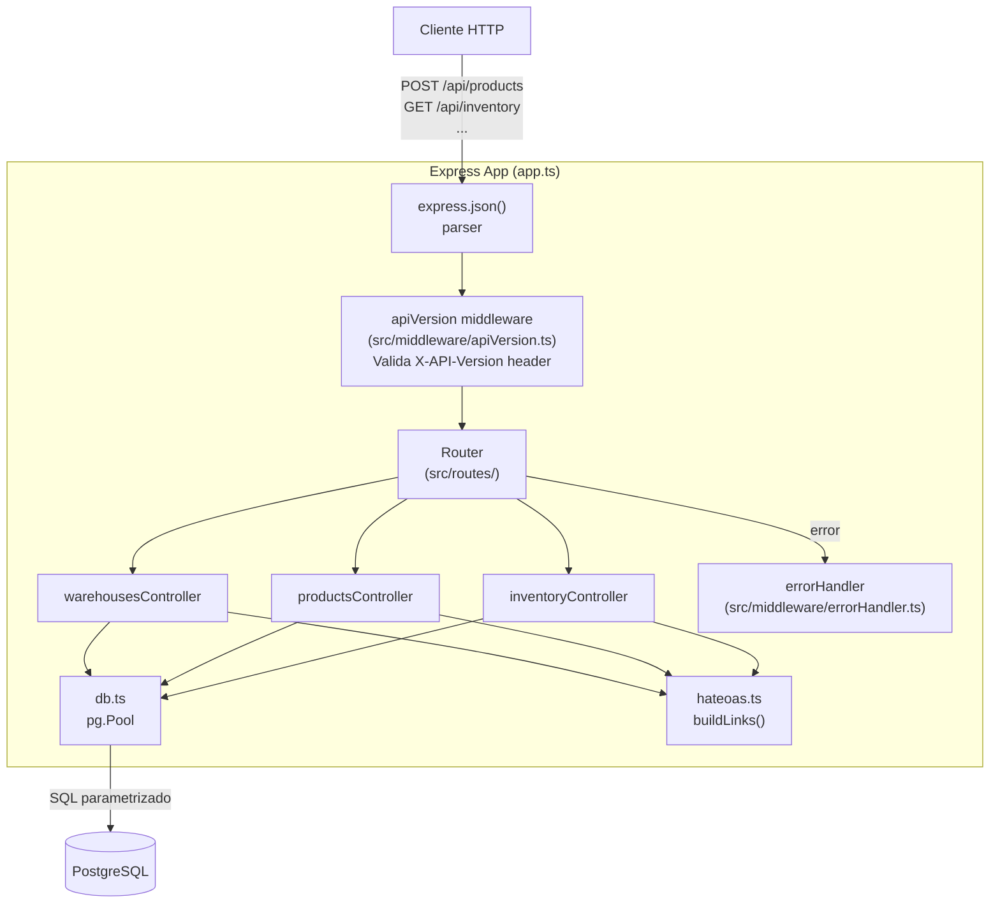

# API REST de Inventario de Almacenes

API RESTful para la gestión de inventario de productos en múltiples almacenes.
Construida con **Node.js + Express + PostgreSQL + TypeScript estricto**, sin ORM.
Entregable del Parcial Práctico de Arquitectura de Software.

---

## Inicio rápido

```bash
# 1. Clonar y pararse en el directorio del proyecto
cd ArquiSoftware

# 2. Levantar la base de datos y la API con Docker Compose
docker compose up --build

# 3. Verificar que la API responde
curl -s http://localhost:3001/health
# → {"status":"ok"}

# 4. Abrir Swagger UI en el navegador
open http://localhost:3001/api-docs
```

> **Variables de entorno**: crear un archivo `.env` copiando `.env.example`
> (los valores por defecto funcionan tal cual con Docker Compose).

> **Puertos**: la API se publica en el host en el puerto **3001** (interno 3000)
> y PostgreSQL en el **5433** (interno 5432). Se eligieron a propósito para
> evitar conflictos con los puertos de desarrollo más comunes (3000 y 5432).
> El puerto de la API puede cambiarse con la variable `PORT` (ej. `PORT=4000 docker compose up`).

---

## Cumplimiento de requisitos del examen

| # | Requisito del examen | Implementación |
|---|---------------------|----------------|
| 1 | GET inventario por almacén (`?warehouseId`) | `GET /api/inventory?warehouseId={id}` → `src/controllers/inventoryController.ts` |
| 2 | POST productos (nombre, sku único, descripción, precio, stock inicial, warehouseId) | `POST /api/products` → `src/controllers/productsController.ts` |
| 3 | Endpoints de soporte HATEOAS | `GET /api/warehouses`, `GET /api/warehouses/:id`, `POST /api/warehouses`, `GET /api/products/:id` |
| 4 | PostgreSQL — entidades `warehouses` y `products` | `db/init.sql` — schema + 3 almacenes + 8 productos seed |
| 5 | Versionado por cabecera personalizada (`X-API-Version: 1`) | `src/middleware/apiVersion.ts` — 400 si falta, 406 si no soportada, eco en respuesta |
| 6 | HATEOAS con objeto `_links` en todas las respuestas | `src/hateoas.ts` — helper tipado `link()` + `buildLinks()` |
| 7 | Códigos HTTP correctos + error handler centralizado + clase `HttpError` | `src/middleware/errorHandler.ts` + `src/types.ts` |
| 8 | OpenAPI 3.0 + Swagger UI en `/api-docs` | `docs/openapi.yaml` + `swagger-ui-express` |
| 9 | JSON en todos los endpoints | `express.json()` global + respuestas siempre `Content-Type: application/json` |

---

## Estructura del proyecto

```
src/
├── server.ts                   # Bootstrap: escucha en $PORT (default 3000)
├── app.ts                      # Express app + wiring de middleware — exportado para tests
├── db.ts                       # pg.Pool configurado desde variables de entorno
├── types.ts                    # Warehouse, Product, DTOs, HalLinks, HttpError
├── hateoas.ts                  # Helpers tipados: link() y buildLinks()
├── middleware/
│   ├── apiVersion.ts           # Validación X-API-Version → 400 / 406
│   └── errorHandler.ts        # Error handler centralizado → JSON consistente
├── routes/
│   ├── warehouses.ts
│   ├── products.ts
│   └── inventory.ts
└── controllers/
    ├── warehousesController.ts
    ├── productsController.ts
    └── inventoryController.ts
db/
└── init.sql                    # Schema + seed data (montado en postgres via initdb.d)
docs/
└── openapi.yaml                # Especificación OpenAPI 3.0 completa
tests/
└── api.test.ts                 # Tests de integración con Supertest + ts-jest
```

---

## Diagramas de arquitectura

### C4 — Diagrama de contenedores



### Diagrama de componentes — Express App



---

## Ejemplos con curl

> Todos los endpoints `/api/*` requieren el header `X-API-Version: 1`.

### GET /api/warehouses — listar almacenes

```bash
curl -s http://localhost:3001/api/warehouses \
  -H "X-API-Version: 1" | jq
```

```json
{
  "data": [
    {
      "id": 1,
      "name": "Central Distribution Center",
      "city": "Buenos Aires",
      "address": "Av. San Martín 1450, CABA",
      "created_at": "2025-01-01T00:00:00.000Z",
      "_links": {
        "self":      { "href": "http://localhost:3001/api/warehouses/1", "method": "GET" },
        "inventory": { "href": "http://localhost:3001/api/inventory?warehouseId=1", "method": "GET" }
      }
    }
  ],
  "_links": {
    "self": { "href": "http://localhost:3001/api/warehouses", "method": "GET" }
  }
}
```

### GET /api/warehouses/:id — obtener almacén por id

```bash
curl -s http://localhost:3001/api/warehouses/1 \
  -H "X-API-Version: 1" | jq
```

### POST /api/warehouses — crear almacén

```bash
curl -s -X POST http://localhost:3001/api/warehouses \
  -H "Content-Type: application/json" \
  -H "X-API-Version: 1" \
  -d '{"name":"East Hub","city":"Mendoza","address":"Ruta 7 Km 1050"}' | jq
```

### GET /api/inventory — inventario de un almacén

```bash
curl -s "http://localhost:3001/api/inventory?warehouseId=1" \
  -H "X-API-Version: 1" | jq
```

```json
{
  "data": {
    "warehouse": { "id": 1, "name": "Central Distribution Center", "...": "..." },
    "products": [
      {
        "id": 1,
        "name": "Laptop ProBook 450",
        "sku": "SKU-LP-001",
        "price": "1299.99",
        "quantity": 45,
        "_links": {
          "self":      { "href": "http://localhost:3001/api/products/1",   "method": "GET" },
          "warehouse": { "href": "http://localhost:3001/api/warehouses/1", "method": "GET" }
        }
      }
    ],
    "totalProducts": 3
  },
  "_links": {
    "self":       { "href": "http://localhost:3001/api/inventory?warehouseId=1", "method": "GET" },
    "warehouse":  { "href": "http://localhost:3001/api/warehouses/1",            "method": "GET" },
    "warehouses": { "href": "http://localhost:3001/api/warehouses",              "method": "GET" }
  }
}
```

### POST /api/products — registrar producto

```bash
curl -s -X POST http://localhost:3001/api/products \
  -H "Content-Type: application/json" \
  -H "X-API-Version: 1" \
  -d '{
    "name": "Webcam HD 1080p",
    "sku": "SKU-WC-001",
    "description": "Full HD webcam with built-in microphone",
    "price": 59.99,
    "quantity": 30,
    "warehouseId": 1
  }' | jq
```

Respuesta `201 Created` con header `Location: http://localhost:3001/api/products/{id}`.

### GET /api/products/:id — obtener producto por id

```bash
curl -s http://localhost:3001/api/products/1 \
  -H "X-API-Version: 1" | jq
```

### Error: header de versión faltante (400)

```bash
curl -s http://localhost:3001/api/warehouses | jq
```

```json
{
  "error": "Missing Required Header",
  "message": "X-API-Version header is required for all /api routes.",
  "requiredHeader": "X-API-Version",
  "supportedVersions": ["1"]
}
```

### Error: versión no soportada (406)

```bash
curl -s http://localhost:3001/api/warehouses \
  -H "X-API-Version: 99" | jq
```

```json
{
  "error": "API Version Not Acceptable",
  "message": "Version \"99\" is not supported. Supported versions: 1",
  "receivedVersion": "99",
  "supportedVersions": ["1"]
}
```

### Error: SKU duplicado (409)

```bash
curl -s -X POST http://localhost:3001/api/products \
  -H "Content-Type: application/json" \
  -H "X-API-Version: 1" \
  -d '{"name":"Dup","sku":"SKU-LP-001","price":10,"quantity":1,"warehouseId":1}' | jq
```

```json
{
  "error": "Conflict",
  "message": "A record with one or more unique fields already exists."
}
```

---

## Cómo correr los tests

Los tests son de integración y necesitan la base de datos corriendo.

```bash
# 1. Levantar solo la base de datos
docker compose up -d db

# 2. Copiar .env.example a .env (ajustar si es necesario)
cp .env.example .env

# 3. Instalar dependencias
npm install

# 4. Correr los tests (la DB del compose publica el puerto 5433 en el host)
DB_HOST=localhost DB_PORT=5433 DB_NAME=inventory DB_USER=postgres DB_PASSWORD=postgres npm test
```

**Tests incluidos** (`tests/api.test.ts`):

| Test | Descripción |
|------|-------------|
| `GET /api/warehouses` sin header | → 400, body con `requiredHeader` |
| `GET /api/warehouses` versión no soportada | → 406 |
| `GET /api/warehouses` válido | → 200, `X-API-Version` en respuesta |
| `GET /api/inventory` sin `warehouseId` | → 400 |
| `GET /api/inventory?warehouseId=abc` | → 400 |
| `GET /api/inventory?warehouseId=99999` | → 404 |
| `GET /api/inventory?warehouseId=1` | → 200 con `_links` correctos |
| `POST /api/products` body vacío | → 400 con array `errors` |
| `POST /api/products` warehouseId inexistente | → 404 |
| `POST /api/products` válido | → 201 con `Location` header |
| `POST /api/products` sku duplicado | → 409 |

---

## Decisiones de diseño

| Área | Decisión | Justificación |
|------|----------|---------------|
| **ORM** | `pg` directo con queries parametrizados | Transparencia en examen oral; sin capa de abstracción que oculte SQL |
| **Módulo TS** | `commonjs` | Compatibilidad directa con Jest + ts-jest sin configuración adicional |
| **Versionado** | Custom request header `X-API-Version` | Requerimiento explícito del enunciado |
| **HATEOAS** | HAL simplificado (`_links` map de `{href, method}`) | Legible y defendible; no requiere biblioteca externa |
| **Errores PG** | Códigos `23505`, `23503`, `23514` en error handler | Mapeo nativo sin ORM — el handler los intercepta antes del 500 genérico |
| **Multi-stage Docker** | Build stage (tsc) + runtime stage (alpine, non-root) | Imagen final liviana (~150 MB); sin devDeps ni fuente TS en producción |
| **Swagger UI** | Cargado desde `docs/openapi.yaml` con el paquete `yaml` | Un solo source of truth; fácil de editar sin recompilar |

---

## Evidencias

Para reproducir evidencias del correcto funcionamiento:

### 1. Tests

```bash
docker compose up -d db
npm install
DB_HOST=localhost DB_PORT=5433 DB_NAME=inventory DB_USER=postgres DB_PASSWORD=postgres npm test
# Esperar output de Jest con todas las suites en verde
```

Capturar salida agregando `2>&1 | tee test-output.txt` al comando anterior.

### 2. Swagger UI

1. `docker compose up --build`
2. Abrir `http://localhost:3001/api-docs`
3. Ejecutar desde la UI: expandir `GET /api/inventory`, ingresar `warehouseId=1`, hacer clic en "Execute"
4. Verificar respuesta 200 con `_links` y `products`

Para captura de pantalla: usar las DevTools del navegador o una herramienta como `scrot`/`screenshot`.

### 3. curl

Ejecutar los comandos de la sección anterior. Con `jq` instalado, las respuestas se muestran con formato coloreado en terminal.
